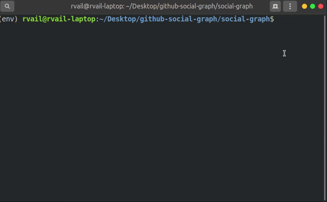
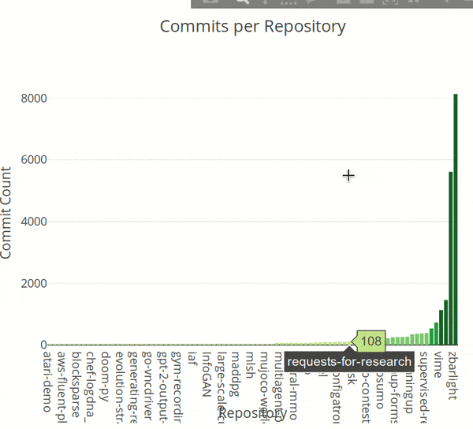
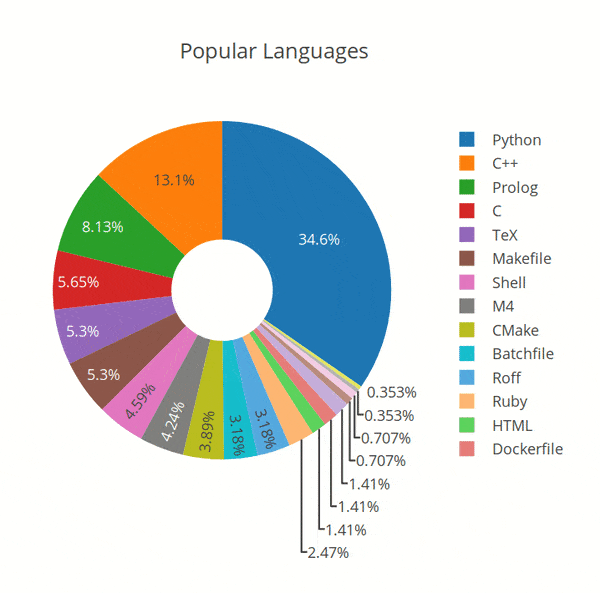
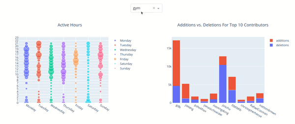

# Github Social Graph
Project for CSU3012 - Software Engineering

Coninuation of [Github Access](https://github.com/rvailnaveed/github-access)

## Live Version
+   https://openai-gitvis.herokuapp.com/
+   May take a few seconds to load as heroku puts the app to "sleep" during periods of inactivity (i.e until it is visited by someone) to ease load on their servers.

## Instructions to Build and Run Locally
+   **Make sure you have** [Python 3.7+](https://www.python.org/downloads/)
+   Clone or download the repo: `git clone https://github.com/rvailnaveed/github-social-graph.git`
+   Navigate to the repo: `cd path/to/the/repo/github-social-graph`
+   Install Dependancies: `pip install -r requirements.txt`
+   Make sure you are in  `github-social-graph/social-graph`
+   Run `python app.py`
+   Navigate to link from terminal or: [http://127.0.0.1:8050/](http://127.0.0.1:8050/)

## Features

### Commits Graph
+   Shows commits across all *openai's* public repositories.
+   Ability to zoom and pan
+   Save graph as PNG, ability to save zoomed in state
+   Colour scheme matches Github's traditional colour scheme     (darker the green -> the more commits)
+   

### Languages Donut
+   Shows the languages used by OpenAI in their repository's and their occurences.
+   Ability to save as PNG
+   Include/Exclude languages shown by clicking entry in legend.
+   Double click entry to show it exclusively.
+   Double click again to revert back to default state.

**Note**. **Following graphs may take a few seconds to load depending on Internet Speed**
### Active Hours
+   Dynamic graph.
+   Changes based on repository selected from dropdown menu.
+   Shows the occurence of commits for every hour of every day.
+   Bubbles sized based on how many commits occured in that hour.
+   Include/Exclude days by clicking respective entry in legend.
+   Zoom and save as PNG.

### Active Contributors
+   Dynamic graph.
+   Changes based on repository selected from dropdown menu.
+   Shows additions and deletions for the top contributors of a repo.
+   Isolate additions/deletions by clicking their respective entries in the legend.
+   Zoom and save as PNG.

